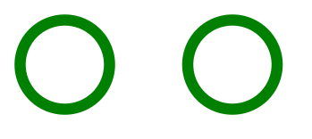
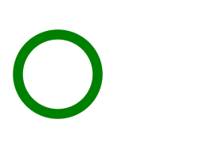

### 一、关于Sprite技术
本文介绍的Sprite技术，类似但非css中应用的雪碧图技术，都是将图形图标整合在一个文件中。svg Sprite在实际使用时，将需要用到的图标单独引用显示在界面，不需要给图标设置定位信息。

### 二、svg Sprite 和 symbol元素
目前，svg Sprite最佳实践是使用symbol元素。symbol元素对于svg Sprite是什么呢？打个比方，svg是一个衣帽间，symbol就是一件一件带标识的衣服。
将三个图标整合到一个svg元素的代码结构是这样的：
```html
<svg>
    <symbol id='icon1'>
        <!--第一个svg图标的path代码-->
    </symbol>
    <symbol id='icon2'>
        <!--第二个svg图标的path代码-->
    </symbol>
    <symbol id='icon3'>
        <!--第三个svg图标的path代码-->
    </symbol>
<svg>
```
如果只有上述代码是无法在界面展示出想要的效果。因为现在只是在衣帽间放置了衣服，并没有将需要的衣服拿出来穿给大家看。
因此，还需要一个“使用”的操作，那就是svg中的use元素。
### 三、svg中的use元素
use元素是一个非常强大的元素，在web开发中，use元素具有两个特点：
1.可重复调用
2.可跨svg调用

#### 1.可重复调用
假设自己好不容易用了几十个坐标绘制一个图形，在不同的位置也需要展示一个同样的图形，你会怎么办？Ctrl+C，Ctrl+V？如果这样，代码里面都是一堆坐标值，可读性差。使用use元素，就是可以重复调用一个一直的svg图形，举个栗子：
```html
 <svg style="width:600px;">
    <symbol id="shape">
        <circle cx="50" cy="50" r="40" stroke-width="10" stroke="green" fill="white" />
    </symbol>

    <use xlink:href="#shape" x="0" />
    <use xlink:href="#shape" x="150" />
</svg>
```

注意到没有，use元素是通过xlink:href属性，就可以调用展示指定的图形。#shape对应的就是id为shape的元素。use元素可以有自己的坐标，以及支持transform变换，甚至可以use其他use元素。
这里，两个use元素使用的是同一个g元素（组合），从而实现了图形的重复调用功能。

#### 2. 跨SVG调用
SVG中的use元素可以调用其他SVG文件的元素，只要在一个文档中。
紧接着上面的栗子：
``` html
<svg><use xlink:href="#shape"/></svg>
```

结果成功显示上述一样的图标。

而这个**跨svg调用**就是“svg Sprite技术”的核心所在。

from: [未来必热：SVG Sprites技术介绍](https://www.zhangxinxu.com/wordpress/2014/07/introduce-svg-sprite-technology/)